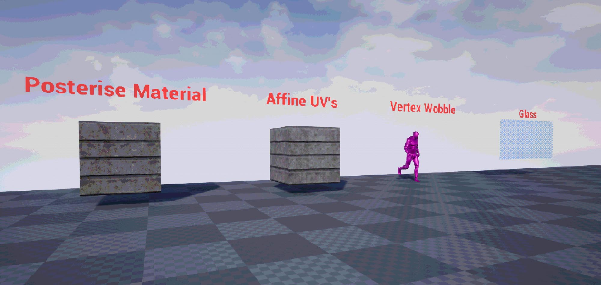
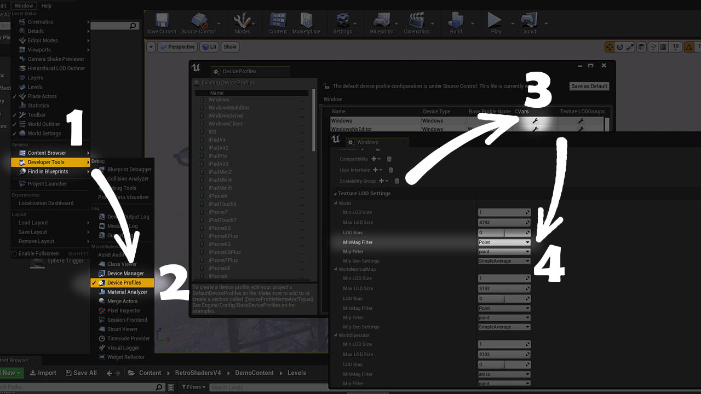

# Retro Shader Pack by DaveFace
**Current Version: v4 (06/06/2021)**

This is an Unreal Engine 4 material & post-process pack for all your retro PS1-esque game needs. I may add more stuff over time but I think this provides the most common effects you'd want for this kind of project. Note that this pack is not intended as a 'realistic' PS1 imitation - if you want to mimic more of the PS1's strange rendering artifacts, I recommend [Marcis' pack available on itch.io here](https://marcis.itch.io/psxfx).

Some functions are based on other people's work online, I've tried to include comments linking to their work where I can remember. If I've forgotten to give someone credit, my apologies, it isn't intentional.

Happy to accept contributions if anyone has improvements / tweaks / new shaders to add.

## Getting Started

For Version 2 and above, I'm distributing this as a complete project. As of Version 4, I'm including a bit more demo content and I'm probably going to add a little prototype retro game, if I get round to it.

All you really need is the 'RetroShader' folder - you can ignore 'DemoContent' if you want. The demo content is optional, none of the core materials / material functions depend on it.

### Unreal Engine Version

This has been made & tested in Unreal Engine version 4.25. It should work in subsequent versions though, as the functionality is pretty basic.

As of writing (June 2021) I have not tested this in Unreal Engine 5 - but it will probably work just fine.

### Using the pack

To use the post-process material, drop 'BP_RetroPostProcess' into your scene - it doesn't matter where. The default settings should 'just work', but everything is commented to explain what's going on. Your main choices are:

 - Whether to use YUV Colour Space, or simple posterise / colour banding. YUV is more faithful to the PS1, but does not handle very colourful scenes so well where you might want to push the available colours up a notch.
 - Dithering method. There are currently two, and I would recommend sticking to accurate bayer dithering (the default) for now - I'm still experimenting with other dither methods. The 'hacky' version provided works well in some scenes, but for most it just messes with the brightness.

I would recommend creating your own Child Blueprint (Right click > Create Child Blueprint Class) and creating your own default settings. This also means that if I update the blueprint in future, any non-breaking changes will simply propagate to your own version without breaking your defaults.

***Major caveat with V4 and above** - To achieve the low resolution look, this system dynamically adjusts the console parameter `r.ScreenPercentage` to hit a target resolution, which drops the render resolution of the frame ([see Unreal docs here](https://docs.unrealengine.com/4.26/en-US/RenderingAndGraphics/ScreenPercentage/)). This does not get previewed in the editor viewport, even in 'Simulate' mode. You will need to be in a Play-in-editor (PIE) session to see it. For look-dev, you can get an approximation by dropping the 'Screen Percentage' amount to 50 in the viewport, by clicking the top left arrow.*

For the full effect, you will also want your materials to use the retro functions - I'd recommend using the provided master materials to create instances from. If you need to integrate the functions into custom materials, affine warping and vertex wobble are created as reusable functions - to understand how/where to use them, just check the included master materials.

### Make all textures use nearest-neighbor
A large part of the retro aesthetic is nearest-neighbor filtering on textures. This can be set on a per-material basis if you really want to - but it's far easier to make this a global setting using Unreal Engine's device profiles.

You can find this under Window > Developer Tools > Device Profiles

Click the tool / spanner icon under 'CVars' on your platform e.g. Windows (note - WindowsNoEditor etc. all inherit from Windows, so no need to edit each one). Then under Texture LOD Settings, for each texture group you want, open the drop-down and set the `MinMagFilter` to `point`. This makes those texture groups render with nearest neighbor filtering by default. I'd recommend doing it for the following:
 - World (the most common)
 - Character
 - Effects
 - Skybox
 - UI
 - Lightmap

