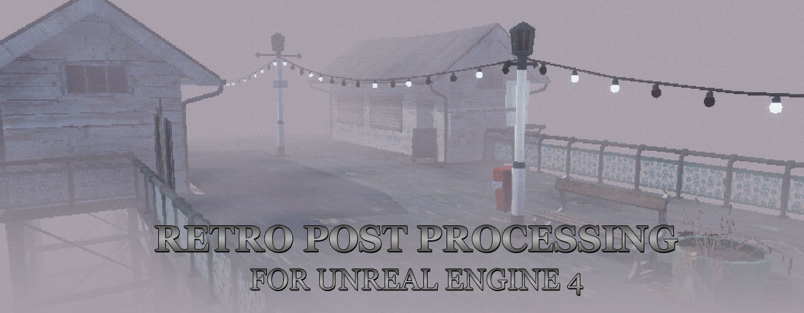

# Retro Shader Pack by DaveFace
**Current Version: v5 (02/02/2022) - for Unreal Engine 4.27**

---

**⚠️ WARNING ⚠️**

This pack is only compatible with Unreal Engine 4. Unreal Engine 5 has significantly changed the rendederscale process (which this shader relied on) without providing any relevant documentation. This combined with my general experience of Unreal Engine 5 means that I will not be using it for future projects. I will accept any pull requests to resolve the issue, but I am not actively working on it.

---

This is an Unreal Engine 4 material & post-process pack for all your retro PS1-esque game needs. I may add more stuff over time but I think this provides the most common effects you'd want for this kind of project. Note that this pack is not intended as a 'realistic' PS1 imitation - if you want to mimic more of the PS1's strange rendering artifacts, I recommend [Marcis' pack available on itch.io here](https://marcis.itch.io/psxfx).

Some functions are based on stuff I've found online, I've tried to include comments linking to their work where I can remember. If I've forgotten to give someone credit, my apologies, it isn't intentional.

Happy to accept contributions if anyone has improvements / tweaks / new shaders to add.

## Getting Started
All you need to bring into your project is the 'RetroShadersV4/RetroShader/' folder. The demo content is optional, none of the core materials / material functions depend on it.

### Unreal Engine Version

This has been made & tested in Unreal Engine version 4.27. **Unreal Engine 5 is not currently supported - see [issue here](https://github.com/DaveFace/UnrealRetroShaders/issues/3)**

### Using the pack

To use the post-process material, drop 'BP_RetroPostProcess' into your scene - it doesn't matter where. The default settings should 'just work', but everything is commented to explain what's going on. Your main choices are:

 - Whether to use YUV Colour Space, or simple posterise / colour banding. YUV is more faithful to the PS1, but does not handle very colourful scenes so well where you might want to push the available colours up a notch.
 - Dithering method. There are currently two, and I would recommend sticking to accurate bayer dithering (the default) for now. The 'hacky' version provided works well in some scenes, but for most, it just screws up the brightness.

I would recommend creating your own Child Blueprint (Right click > Create Child Blueprint Class) and creating your own default settings. This also means that if I update the blueprint in future, any non-breaking changes will simply propagate to your own version without breaking your defaults.

***Major caveat with V4 and above** - To achieve the low resolution look, this system dynamically adjusts the console parameter `r.ScreenPercentage` to hit a target resolution, which drops the render resolution of the frame ([see Unreal docs here](https://docs.unrealengine.com/4.26/en-US/RenderingAndGraphics/ScreenPercentage/)). This only happens when the game is running, so you will not see a preview in the viewport even if you are in Simulate. You will need to be in a Play-in-editor (PIE) session to see it. For look-dev, you can get an approximation by dropping the 'Screen Percentage' amount to 50 in the viewport, by clicking the top left arrow.*

For the full effect, you will also want your materials to use the retro functions - I'd recommend using the provided master materials to create instances from. If you need to integrate the functions into custom materials, affine warping and vertex wobble are created as reusable functions - to understand how/where to use them, just check the included master materials.

### Optional Step #1 - Disable Grain Quantization
Grain Quantization is a fancy tonemapper feature that adds a subtle noise (not the same as the 'grain' setting), which under normal circumstances smooths out the gradient banding you see on 8 bit monitors. But in our case, because we're deliberately reducing our colour values, the grain becomes a bit obvious particularly in dark areas.

#### TL;DR to turn it off
Unfortunately, this one is a bit of a pain in the ass because the included cvars which *should* control this setting like `r.Tonemapper.GrainQuantization 0` don't. Thanks, Epic! 👍

1. Go to C:\Program Files\Epic Games\UE_4.27\Engine\Shaders\Private
2. Open PostProcessTonemap.usf in Notepad
3. Add the line `#undef USE_GRAIN_QUANTIZATION` to the top of the file

You may have noticed that we just edited an engine shader: congratulations, now all of your Unreal projects will look slightly worse.

*I haven't actually tested if this works in a shipping build - if anyone knows a better way to do this, let me know!*

### Optional Step #2a - Make all textures use nearest-neighbor automatically
A large part of the retro aesthetic is nearest-neighbor filtering on textures. This can be set on a per-material basis if you really want to - but it's far easier to make this a global setting using Unreal Engine's device profiles.

You can find this under:
- **Window > Developer Tools > Device Profile** in Unreal Engine 4
- **Tools > Platforms > Device Profiles** in Unreal Engine 5

Click the tool / spanner icon under 'CVars' on your platform e.g. Windows (note - WindowsNoEditor etc. all inherit from Windows, so no need to edit each one). Then under Texture LOD Settings, for each texture group you want, open the drop-down and set the `MinMagFilter` to `point`. This makes those texture groups render with nearest neighbor filtering by default. I'd recommend doing it for the following:
 - World (the most common)
 - Character
 - Effects
 - Skybox
 - UI
 - Lightmap

### Optional Step #2b - Make textures use nearest-neighbor manually

If for some reason you don't want to affect all textures, you can make individual textures unfiltered by setting the texture group to '2D Pixels (Unfiltered)' instead of the default 'World', or by manually setting the Filter to Nearest. You can do this in the properties window per-texture, or via the Bulk Property editor.

This will only work on assets you import, so this won't work for things like lightmaps.

Credits
=======
Core Content
------------
- YUV colour conversion / Bayer implementation by [Jazz Mickle](https://twitter.com/jazzmickle/status/1269238990827335689)

Demo Content
------------
- Texures based on images from www.textures.com
- There's a couple Epic samples in there e.g. the waves
- Everything else is original / free to use
